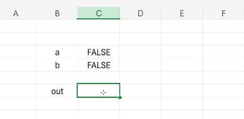

+++
authors = ["Giorgio Dell'Immagine"]
title = "Forget expensive hardware simulators, Microsoft Excel is all you need!"
date = "2024-10-20"
description = "Forget expensive hardware simulators, Microsoft Excel is all you need!"
tags = [
    "Excel",
    "Verilog",
    "Writeup"
]
math = true
+++


> **Fun fact** - The original experimentation spreadsheet was called `curso1` and was done in Google Sheets. I nearly fried my PC twice running a heavy computation in the browser, so I switched to Excel, which turned out to be much more performant.

# The origin story
One day, I received a voice message from a (probably drunk) [drw0if](https://x.com/drw0if) pitching the idea of simulating hardware on Excel. He described a circuit being run over a spreadsheet, potentially synthesized from a higher-level HDL. The idea sounded silly, but we lacked ideas for upcoming CTF challenges, so we decided to give it a shot!

The basic concept was simple: Excel can easily express combinatorial circuits. In fact, we can:
- Treat every wire as a cell.
- Simulate logic gates using formulas that reference other cells.

Luckily, Excel provides all the logical operators we’d ever need, such as `AND`, `OR`, and `NOT`! Let’s consider this simple combinatorial Verilog module, which computes the negation of `a` and its conjunction with `b`.


```verilog
module example(a, b, out);
    input a, b;
    output out;

    assign out = ~a & b;
endmodule
```

We can easily convert this to an Excel spreadsheet. The great thing is that if we update the inputs, the output will automatically update, just like real hardware!





Now, if you're still with me, I know what you're thinking: boooooring. We can just translate a circuit into an Excel formula and call it a day. But I promise, things will get interesting.

# Welcome, iterative computation

Iterative computation is a somewhat obscure feature of Excel. Normally, when you input formulas that create a reference cycle, Excel returns an error because there’s no clear data dependency between the cell values. However, Excel has a feature for computing iterative methods (such as Newton’s method), which can be enabled in the settings.





Excel's [calculation process](https://www.decisionmodels.com/calcsecretsc.htm) is quite straightforward in typical scenarios: all formula references can be put into a dependency graph, and Excel walks through this graph to update cells as needed. This enables partial computation when updates only affect certain formulas. Excel also cleverly divides branches of the dependency graph into different threads to speed up calculations.

What happens when **iterative computation** is enabled? The reference cycles mean there’s no clear evaluation order (the dependency graph is no longer a DAG). So, Excel simply updates each cell in sequence, starting from the top row and moving left, then the second row, and so on. This process continues until:
- The value changes between two iterations fall below a certain threshold, or
- The iteration limit is reached.

For this post, we'll assume the iteration limit is set to `1`, so Excel performs only one update per cycle.


A neat trick to force Excel to update the entire sheet while iterative computation is enabled is to click on a random cell and press `Del`.
Excel will think something important was deleted and frantically update every cell! 😆






# Synchronized hardware primitives

What happens when we tell Excel that a cell should be the negation of itself? We get a nice **clock**!





Do you see where this is going?
The next step is to simulate a working memory element in Excel, enabling us to run sequential logic with a clock.
Specifically, we want to implement a [D-Flip-Flop](https://en.wikipedia.org/wiki/Flip-flop_(electronics)#D_flip-flop), which has clock and data inputs and a data output.
At the **rising edge** of the clock, it stores the current data input value and holds it until the next rising edge.
The truth table (from Wikipedia) looks like this:

| Clock | D | Q_next |
|:---:|:---:|:---:|
Rising edge | 0 | 0
Rising edge | 1 | 1
Non-rising | X	| Q

How do we simulate this rising clock behavior?
We can divide the clock cycle into micro-clocks, which are multiple discrete simulation steps where the main clock signal doesn’t update.
The DFF records the input value at the last micro-clock when the clock signal is low and outputs the recorded value at the next micro-clock, the first one where the clock is high.





This can be implemented using a micro-clock counter and resolution.
The clock signal updates only when the micro-clock counter hits zero.
The DFF records the input value when the clock is low, and the micro-clock is at its last value in the cycle.
In a circuit with multiple DFFs, all are updated simultaneously in the same sheet update.

With a few Excel formulas, we can easily implement this behavior:
```py
clock_res = 10

# current micro-clock
micro_clk = MOD(micro_clk + 1, clock_res)

# clock is updated every clock_res micro-clocks
clk = IF(micro_clk = 0, NOT(clk), clk)

# DFF cell, updated only at the last micro-clock of low clk with data_in
dff_state = IF(AND(NOT(clk), micro_clk = clock_res - 1), data_in, dff_state)

# DFF output, not updated until the first micro-clock of high clk
dff_out = IF(AND(NOT(clk), micro_clk = clock_res - 1), dff_out, dff_state)
```

Why does it have to be this complicated? Well, because in the end we want to simulate some sequential logic, with the input and output of DFFs feeding into each other in a loop.
Using this method ensures that all the inputs are sampled at the same sheet update, avoiding weird glitches that sometimes happened.
Of course, if some inputs in the circuit change at this last micro-clock then we could have inconsistent behavior, but we will make the assumption that the network has stabilized before the last micro-clock.
We should therefore choose a clock resolution that is small enough to capture the correct behavior of the circuit, but not too small to make the simulation slow.

# From Verilog to Excel

So far we have the following building blocks:
- A clock signal.
- The ability to simulate combinatorial logic.
- The ability to place DFFs in the circuit.

Now, we are ready to write a Verilog program, synthesize it into a netlist, and then convert the netlist into an Excel spreadsheet.
Fortunately this is way easier than I expected thanks to [yosys](https://github.com/YosysHQ/yosys), an open source synthesis suite that can convert Verilog into a netlist.
This is also very similar to what Zellic have done in their [MPC from scratch](https://www.zellic.io/blog/mpc-from-scratch/) post, which I recommend checking out!

Let's write a `primitives.lib` file, which basically describes the set of hardware primitives we have available in the hardware (Excel).
We will support `NAND`, `NOR`, `NOT`, and `DFF` primitives.

```txt
library(demo) {
  cell(NOT) {
    area: 3;
    pin(A) { direction: input; }
    pin(Y) { direction: output;
              function: "A'"; }
  }
  cell(BUF) {
    area: 6;
    pin(A) { direction: input; }
    pin(Y) { direction: output;
              function: "A"; }
  }
  cell(NAND) {
    area: 4;
    pin(A) { direction: input; }
    pin(B) { direction: input; }
    pin(Y) { direction: output;
             function: "(A*B)'"; }
  }
  cell(NOR) {
    area: 4;
    pin(A) { direction: input; }
    pin(B) { direction: input; }
    pin(Y) { direction: output;
             function: "(A+B)'"; }
  }
  cell(DFF) {
    area: 18;
    ff(IQ, IQN) { clocked_on: C;
                  next_state: D; }
    pin(C) { direction: input;
                 clock: true; }
    pin(D) { direction: input; }
    pin(Q) { direction: output;
              function: "IQ"; }
  }
}
```

Next, we write a synthesizer script to convert generic Verilog code into Verilog that only uses our available hardware primitives.

```sh
# read design
read_verilog input.v
hierarchy -check
synth -auto-top -flatten
proc_prune

# high-level synthesis
proc; opt; fsm; opt; memory; opt

# low-level synthesis
techmap; opt

# map to target architecture
dfflibmap -liberty ../yosys-lib/primitives.lib
abc -liberty ../yosys-lib/primitives.lib


splitnets -ports; opt
setundef -zero -undriven -init
clean

# write synthesized design
write_verilog output.v
```

This script will take a `input.v` file, synthesize it into a netlist using the primitives we have available, and then write the result into `output.v`, which will look something like this.





Finally, we convert the Verilog file into Excel using a simple Python script that assigns each wire to a cell and implements the logic and memory gates.

# The epilogue

Our original idea was to create a CTF challenge where participants reverse-engineer a circuit from an Excel spreadsheet.
We wrote a simple flag checker in Verilog, tested it, added some styling, and here’s the result.




> You can download the original attachment [here](https://github.com/fibonhack/MOCA-2024-finals-challs/tree/main/misc/curso1/attachments).

We tested this method on a circuit with around 14k wires and 550 clock cycles.
Running the flag checker takes about four minutes, which is a lot for a few hundreds clock cycles, but still manageable.

The funny thing is that while testing it, nobody in our team was able to solve it, even after some hints.
With the optimizaions and reorderings done by yosys, it was *very* hard to reverse engineer the circuit from the spreadsheet.
We actually ended up releasing it as a meme challenge, explicitly stating to the participants that they should not waste a lot of time on it.
Unsurprisingly, no teams managed to solved it, so I guess there is a limit to the cursedness of a challenge! 😆

In the end, should you use Excel to simulate hardware? Probably not.